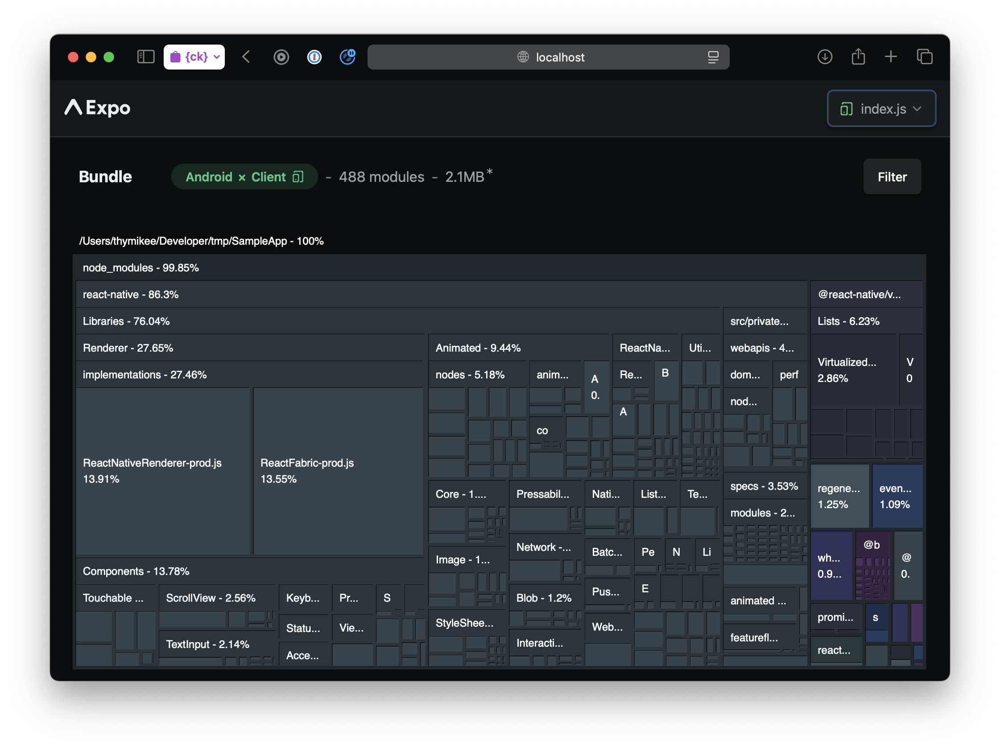

# Skill: Analyze JS Bundle Size

Use **Expo Atlas** to visualize what's in your JavaScript bundle. metamask-mobile
is an Expo project (Metro bundler), and Atlas is the Expo-first-party analyzer —
its hooks are built into the Expo CLI, so you enable it on the `expo export` you
already run.

## Quick Command

```bash
# One-time: add the Atlas viewer (Expo pins the SDK-compatible version)
yarn expo install expo-atlas

# Emit bundle data, then open the treemap viewer
EXPO_ATLAS=1 yarn expo export --platform ios
yarn expo-atlas
```

> Don't `npx expo-atlas` — `npx` fetches and runs an unpinned remote version on
> every call. `yarn expo install` pins the SDK-compatible version once.

## When to Use

- JS bundle seems too large
- Want to identify heavy dependencies
- Investigating startup time issues
- Before/after optimization comparison

> **Note**: Atlas produces a visual treemap (browser UI). Treemap analysis may
> require exported reports, browser screenshots, or human review.

## Understanding Hermes Bytecode

Modern React Native (0.70+) uses Hermes bytecode, not raw JavaScript:

- Skips parsing at runtime
- Still benefits from smaller bundles
- Heavy imports still execute on startup

**Impact of bundle size:**

- Larger bytecode = longer download from store
- More imports on init path = slower TTI

## Expo Atlas

The Atlas **data emission** is built into the Expo CLI (the `EXPO_ATLAS` env var
on `expo export` / `expo start`); the `expo-atlas` package provides the
**viewer**. Add it once with `yarn expo install expo-atlas`.

### Generate + view

```bash
# Export with Atlas enabled
EXPO_ATLAS=1 yarn expo export --platform ios

# Or while running the dev server
EXPO_ATLAS=1 yarn expo start

# Open the treemap viewer (reads .expo/atlas.jsonl)
yarn expo-atlas
```

(The older env var name `EXPO_UNSTABLE_ATLAS=true` still works on some versions.)



The treemap shows module sizes and dependencies — box area is proportional to
size. Drill into `node_modules/` to find the heaviest packages (e.g.
`react-native` core, renderer, `Animated`, `virtualized-lists`).

## What to Look For

### Red Flags

| Finding | Problem | Solution |
|---------|---------|----------|
| Entire library imported | Barrel exports | Use direct imports |
| Duplicate packages | Multiple versions | Dedupe in `package.json` |
| Dev dependencies in bundle | Incorrect imports | Check conditional imports |
| Large polyfills | Unnecessary for Hermes | Remove (see [native-sdks-over-polyfills.md](./native-sdks-over-polyfills.md)) |
| Moment.js with locales | Bloated date library | Switch to `dayjs` (already installed) |

### Common Offenders

- **Lodash full import**: use specific submodule imports (`import x from 'lodash/x'`)
- **Moment.js**: replace with `dayjs` (already installed)
- **Intl polyfills**: check Hermes API and method coverage before removing them
- **AWS SDK**: import specific services only

## Code Examples

### Identify Barrel Import Impact

```tsx
// BAD: Imports entire library through barrel
import { format } from 'date-fns';
// In bundle: all of date-fns loaded

// GOOD: Direct import
import format from 'date-fns/format';
// In bundle: only the format function
```

## Comparing Bundles

Run Atlas before and after a change (or on two branches) and compare the
treemaps — the heaviest boxes that grew/shrank show where the change landed.

## Related Skills

- [bundle-barrel-exports.md](./bundle-barrel-exports.md) - Fix barrel import issues
- [bundle-tree-shaking.md](./bundle-tree-shaking.md) - Enable dead code elimination
- [bundle-library-size.md](./bundle-library-size.md) - Check library sizes before adding
