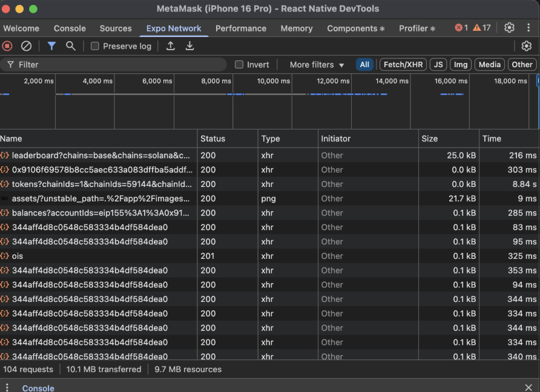

# Skill: Inspect Network Requests

Inspect the network requests your app makes — timings, headers, response previews, and where each request was initiated.

## Quick Command

```bash
# Open React Native DevTools (press 'j' in the Metro terminal, or shake → "Open DevTools")
# Go to the Network tab → requests are recorded automatically while DevTools is open
```

**What is captured:** `fetch()`, `XMLHttpRequest`, and `<Image>` requests. Support for custom networking libraries (such as Expo Fetch) is coming in a later release.

## When to Use

- A screen is slow and you need to know if it's waiting on the network
- Verifying request/response headers, payloads, or status codes
- Checking API timings (TTFB, download) for a flow
- Finding _where in your code_ a request was initiated
- Confirming duplicate or redundant requests during a flow

## Step-by-Step Instructions

### 1. Open the Network Panel

```bash
# Press 'j' in Metro, or shake → "Open DevTools"
# Go to the Network tab (requests record automatically while DevTools is open)
```

### 2. Reproduce the Flow



Perform the interaction under review. Each logged request shows detailed metadata:

- **Timings** — how long the request took (queueing, waiting, download)
- **Headers** — request and response headers
- **Response previews** — the response body preview

### 3. See the details of a request

Tap on a request to see the details of the request.

### 4. Cross-Reference the Performance Panel

Network events also appear in the **Network track** of the [Performance panel](js-performance-panel.md). Use that when you want to see requests interleaved with React scheduler activity and JS execution on one timeline — e.g. to prove a screen is network-bound rather than render-bound.

## Expo Network vs Chrome's Network tab

The React Native team is working with Expo to integrate Expo Fetch and third-party networking libraries into the new pipeline in future releases to further align with Chrome's Network Tab features.

## Interpreting Results

| What you see                         | Likely cause                                 | Where to go next                                                                               |
| ------------------------------------ | -------------------------------------------- | ---------------------------------------------------------------------------------------------- |
| Long **waiting/TTFB** on a request   | Server/backend latency, not your app         | Backend/API investigation; consider caching/prefetch                                           |
| Many requests fired for one screen   | Per-item/per-tab fetching, request waterfall | [mm-eager-work-on-mount.md](mm-eager-work-on-mount.md)                                         |
| Duplicate identical requests         | Missing dedup/cache; re-fetch on re-render   | Gate the fetch; check the Initiator call stack                                                 |
| Requests fine but screen still janky | Not network-bound — it's render/JS           | [js-performance-panel.md](js-performance-panel.md), [js-profile-react.md](js-profile-react.md) |
| Live prices/order book feel slow     | WebSocket-based; not captured here           | [mm-streaming-realtime.md](mm-streaming-realtime.md)                                           |

## Limitations

- **WebSocket events** — not captured (use another tool for websocket flows)
- **Network response mocking**
- **Simulated network throttling**
- **No request initiator support**

**Response preview buffer:** previews are cached on-device with a max size of **100MB**. If the cache overflows, older response previews are evicted (oldest first) — request metadata is kept, but the preview body may be gone.

## Common Pitfalls

- **Expecting websocket traffic**: WebSocket events aren't captured — the Network panel only covers `fetch()`, `XMLHttpRequest`, and `<Image>`.
- **Blaming the network for render jank**: confirm with the Performance panel before optimizing requests.

## Related Skills

- [js-performance-panel.md](./js-performance-panel.md) - See network events on the full timeline (Network track)
- [mm-streaming-realtime.md](./mm-streaming-realtime.md) - Websocket / real-time flows (not covered by the Network panel)
- [mm-tools.md](./mm-tools.md) - Symptom-first tool routing (Reactotron for pre-0.83 Android network)
