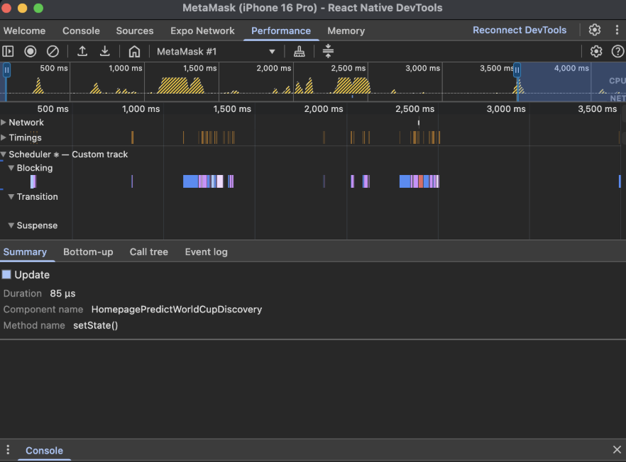
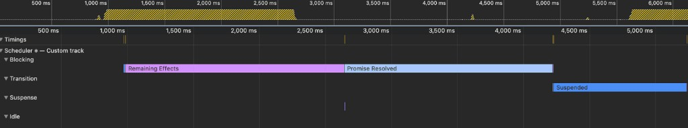
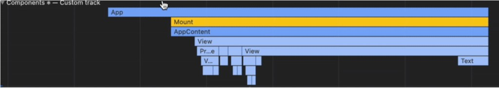

# Skill: Profile with the Performance Panel

> The Performance panel is the **full-timeline** tool: it shows React scheduler activity, the Components flamegraph, the JS thread, and Network events on one timeline. Use the [Profiler](js-profile-react.md) when you only care about which components re-rendered and why; reach for the Performance panel when you need to see _how React work interleaves with your JS and network on the timeline_.

Record a single performance timeline that combines React scheduler activity, component render/effect time, and raw JavaScript execution to find where a flow actually spends its time.

## When to Use

- A flow feels slow but the Profiler alone doesn't explain it (need JS + React + network on one timeline)
- Investigating jank caused by long JS functions, not just re-renders
- Understanding _when_ a UI update is actually painted relative to effects
- Sharing an annotated trace with a teammate

## Step-by-Step Instructions

### 1. Open React Native DevTools

```bash
# Option A: Press 'j' in the Metro terminal (RN CLI and Expo)
# Option B: Shake device / Cmd+D (iOS) / Cmd+M (Android) → "Open DevTools"
```

### 2. Record a Trace



```
1. Go to the Performance tab
2. Press Record
3. Perform the exact interaction or navigation flow you want to analyze
4. Press Stop
```

The recorded trace contains three sections, top to bottom: **Scheduler tracks**, **Components**, and **Thread**.

### 3. Read the Scheduler Tracks



The React Scheduler manages timing and prioritization of UI updates. Since React 19 / concurrent rendering, it's split into four priority tracks:

| Track          | Priority | What runs here                                                |
| -------------- | -------- | ------------------------------------------------------------- |
| **Blocking**   | Highest  | High-priority updates that block the UI                       |
| **Transition** | Medium   | Work from `useTransition`; deprioritized state updates        |
| **Suspense**   | —        | Work related to `React.Suspense`                              |
| **Idle**       | Lowest   | Runs only when nothing else is scheduled (used by `Activity`) |

Within a track, a UI update moves through five phases:

1. **Update** — computing what caused the render
2. **Render** — calling component render functions + reconciliation
3. **Commit** — applying the tree update, including layout effects (they run before paint but count as commit)
4. **Waiting for paint** — React is done; the pixels are about to be painted
5. **Remaining Effects** — passive effects (`useEffect`) run

**When does paint happen?** This trips people up:

- Re-render caused by a **user interaction** (e.g. button press) → paint happens **after Remaining Effects**. A long `useEffect` delays the visible update.
- Re-render **not** caused by interaction (e.g. `setTimeout`) → paint happens **after Commit**.

Other markers you may see in these tracks:

- **Promise Resolved** — a UI-blocking promise resolution
- **Cascading updates** — React paused an update because a newer one began
- **Suspended** — a `useTransition`-marked render was postponed

### 4. Read the Components Flamegraph



Shows execution time for the updated component and its children, color-coded by phase:

- **Blue** — render function time
- **Purple/red** — remaining effects time (only shows effects ≥ 0.05 ms, or ones that triggered an update)
- **Yellow** — mounting/unmounting a subtree

This links specific components to the React activity and JS timeline above/below — deeper context than the Profiler alone.

### 5. Read the Thread (JS) Flamegraph

The Thread section is the JS activity flamegraph — exact execution time of functions in your code. This is the tool for finding heavy JavaScript.

- Most React-internal frames are hidden by default so you see your code.
- Need the full picture? Turn off the ignore list: **Settings > Ignore list > Enable ignore list**.

### 6. Add Labels & Annotations (optional)

- **Double-click** an item and type to add a label.
- After double-clicking, drag the **arrow** onto another item to link two events.
- **Shift-drag** across the timeline to annotate/measure a span (also a quick way to read a duration in **seconds**).
- Annotations appear in the side panel and persist in a downloaded trace — useful before sharing.

## Interpreting Results

| What you see                                  | Likely cause                                      | Where to go next                                                                                       |
| --------------------------------------------- | ------------------------------------------------- | ------------------------------------------------------------------------------------------------------ |
| Long **Render** phase, many components blue   | Heavy/cascading re-renders                        | [js-profile-react.md](./js-profile-react.md), [mm-selector-memoization.md](mm-selector-memoization.md) |
| Long **Remaining Effects** delaying paint     | Expensive `useEffect` after interaction           | Defer/move effect work; split the effect                                                               |
| Long single frame in **Thread**               | Heavy synchronous JS                              | Move off the main path; `useDeferredValue` ([js-concurrent-react.md](js-concurrent-react.md))          |
| **Cascading updates** / **Suspended** markers | Competing updates or `useTransition` postponement | [js-concurrent-react.md](js-concurrent-react.md)                                                       |
| Network events dominate the timeline          | It's data-bound, not render-bound                 | [js-network-panel.md](js-network-panel.md), [mm-streaming-realtime.md](mm-streaming-realtime.md)       |

## Common Pitfalls

- **Profiling in Dev vs Non-dev Mode will produce different numbers**: dev builds skew timings — disable JS Dev Mode (Android: Settings > JS Dev Mode) if needed.

## Related Skills

- [js-profile-react.md](./js-profile-react.md) - Component re-render analysis (Profiler tab)
- [js-network-panel.md](./js-network-panel.md) - Inspect the network requests shown in the Network track
- [js-measure-fps.md](./js-measure-fps.md) - Quantify frame-rate impact
